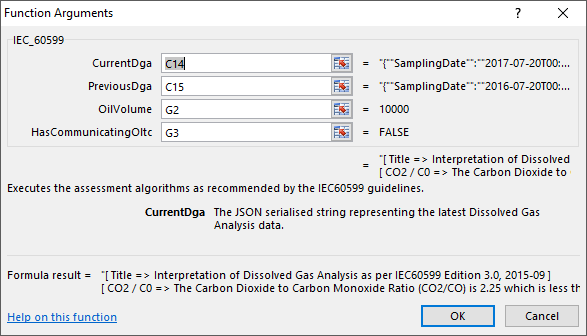
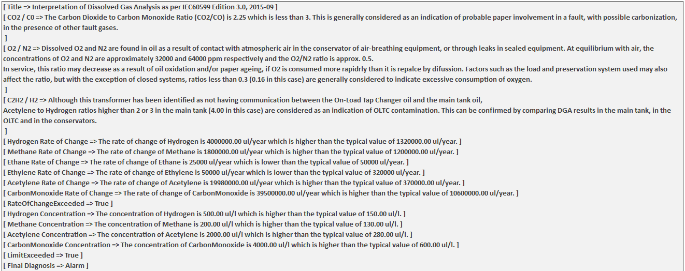

# xDGA

**xDGA** is an Excel add-in that gives you the capability to apply Dissolved Gases Analysis (DGA) algorithms from all the major international guidelines.

**xDGA** helps the user to use their existing DGA data and be able to quicly run assessments algorithms from any of the major international guidelines and industry best practices.

In it's current version, **xDGA** implements only the recommendations contained in the IEC 60599 ed.3 2015.

## Usage

The add-in is activated by opening the **xDGA.ADDIN64.xll** or **xDGA.ADDIN.xll** file, depending on your architecture. Both files are in the **Distribution** folder and they are stand-alone (i.e. don't need other files or libraries to run).

The formulas can then be applied to any Excel spreadsheet with DGA data.

At the moment there are two main functions implemented.

* SERIALIZEDGA()
* IEC_60599()

The SERIALIZEDGA() function accepts the date and the nine gases that constitute one DGA instance. The function produces a string with the JSON serialised version of the data.

  

This is a helper function that prepares the date that can then be fed into the IEC_60599() funciton.

The IEC_60599() function takes in the Current and the Previous DGA as well as a boolean value indicating whether the transformer has an On-Load Tap Changer (OLTC) and the volume of oil in the tank in litres.

  

The IEC_60599() function returns a string with all the outputs and results of running the rules outlined in the guideline.

  

Explore the example file to get a better understanding of how these two functions work together.

More guidelines are being implemented and will be released in the future, including IEEE and CIGRE guidelines.

xDGA uses these great Open Source libraries:
* [ExcelDna](https://excel-dna.net/)
* [Json.NET](http://www.newtonsoft.com/json)