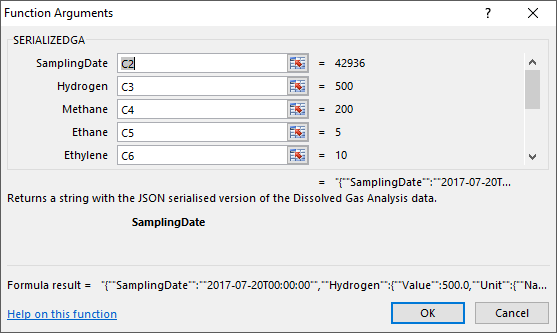

# xDGA

**xDGA** is an Excel add-in that contains custom formulas that apply Dissolved Gases Analysis (DGA) algorithms from all the major international guidelines.

**xDGA** implements the following guidelines and algorithms:

* IEC 60599 ed.3 2015.
* IEEE DRAFT PC57.104/D4.1, October 2017
* Duval Triangles for Transformers, Reactors, Cables and On-Load Tap Changers
* Duval Pentagons
* Rogers Ratios

## Usage

The add-in is activated by opening the **xDGA.ADDIN64.xll** or **xDGA.ADDIN.xll** file, depending on your architecture. Both files are in the <a href="Distribution">**Distribution**</a> folder and they are stand-alone (i.e. don't need other files or libraries to run).

The formulas can then be applied to any Excel spreadsheet with DGA data.

The following Excel functions are implemented.

* SERIALIZEDGA()
* IEC_60599()
* IEEE_C57104()
* DUVALTRIANGLES()
* DUVALTRIANGLES_OLTC()
* DUVALPENTAGONS()
* ROGERSRATIOS()

The SERIALIZEDGA() function accepts the date and the nine gases that constitute one DGA instance. The function produces a string with the JSON serialised version of the data.

  

This is a helper function that prepares DGA data in a way that can be fed into any of the funcitons that require it.

For example, the IEC_60599() function takes in the Current and the Previous DGA as well as a boolean value indicating whether the transformer has an On-Load Tap Changer (OLTC) and the volume of oil in the tank in litres.

  

The IEC_60599() function returns a string with all the outputs and results of running the rules outlined in the guideline.

  

Explore the <a href="https://github.com/engineers-tools/xDGA/raw/master/Distribution/xDGA%20Example%20Usage.xlsx">example file</a> to get a better understanding of how these two functions work together.

More guidelines are being implemented and will be released in the future, including IEEE and CIGRE guidelines.

xDGA uses these great Open Source libraries:
* [ExcelDna](https://excel-dna.net/)
* [Json.NET](http://www.newtonsoft.com/json)
